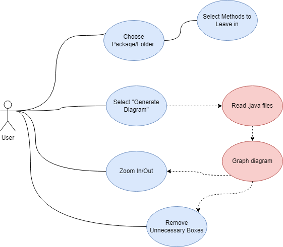

# Project: InstantUML - Instantly generate your project UML
## Team 10 - Reece Kim, Trique Nguyen, Brian Pham
| Members | Proposal Contribution |
| ------- | --------------------- |
| Reece Kim | Came up with problem statements and provided solutions Researched and analyzed the pros and cons of existing products on the market  Designed the overall functionalities of the project   Designed Class and Use Case Diagram|
| Trique Nguyen | Researched on developing a plugin for IntelliJ IDEA   Designed the plan and approach for the team to follow on   Came up with the initial tools used for the project   Designed the Sequence Diagram |
| Brian Pham | Designed the State Diagram   Stylized/Rewording of proposal report | 

| Members | Presentation Contribution |
| ------- | --------------------- |
| Reece Kim | Contribute to the presentation design in Canva   Explain the user flow |
| Trique Nguyen | Designed and animate presentation in Canva   Present the opening,discuss troblem statements and existing products |
| Brian Pham | Explain the tech stack / tools used in the project | 

| Members | Project Contribution |
| ------- | --------------------- |
| Reece Kim | |
| Trique Nguyen | Researched and experimented  on GraphViz API   Implement GraphViz to generate the diagram   Display the diagram on the plugin user interface |
| Brian Pham |  | 

## Survey on previous works and their problems/issues
- [IntelliJ Ultimate](https://www.jetbrains.com/idea/business/) [1]:
  - Comes with the paid version of IntelliJ for $16.90 per month
  - Smarter and interactive, you click on a package and it generates the diagram
  - Able to edit contents within the diagram
- [UML Generator](https://plugins.jetbrains.com/plugin/15124-uml-generator) (Existing IntelliJ plugin) [2]:
  - Can’t edit the contents within the boxes, can only delete the boxes
  - If there are enough boxes, then the connectors overlap with the boxes
  - Creates associations with DataTypes from the default Java library, which are not needed
- [Magic UML](https://github.com/xukmin/magicuml) [3]:
  - A GitHub project from 7 years ago
  - Does not have a GUI
  - Seems to have to input each .java file individually in order to use it

## Diagrams
| Diagram | Summary |
| ------- | --------------------- |
| [Class Diagram](./diagrams/Class%20Diagram.drawio.png) | Edit |
| [State Diagram](./diagrams/State%20Diagram.drawio.png) | Edit |
| [Use Case Diagram](./diagrams/Use_Case_Diagram.drawio.png) | Edit | 
| [Sequence Diagram](./diagrams/SequenceDiagram.drawio.png)| Edit |
<!-- Use if need images

[Class Diagram](./diagrams/Class%20Diagram.drawio.png)
 

--- 

[State Diagram](./diagrams/State%20Diagram.drawio.png)
 

---

[Use Case Diagram](./diagrams/Use_Case_Diagram.drawio.png)
 

---

[Sequence Diagram](./diagrams/SequenceDiagram.drawio.png)
 

---

-->
## Functionalities
- A free software/plugin, available for every Intellij type of user
- Improves productivity by allowing the user to see the high level relations between the classes directly in the IDE
- Easier usage of code selection in diagram generation (Ask if to leave out certain classes: public, protected, etc. of the diagram)
- Simple selection of package/code from the user to generate the diagram from.

## Operations
- Choosing package(s) to use for diagram generation
- Visualize/display relationships between classes
- Allow editing of diagram generation layout when choosing package
- Selection of code to be used in diagram(s) (getters, setters, etc.)
- Let the user add constraints to the diagram.

## Solutions

## Instructions

## Snapshots

